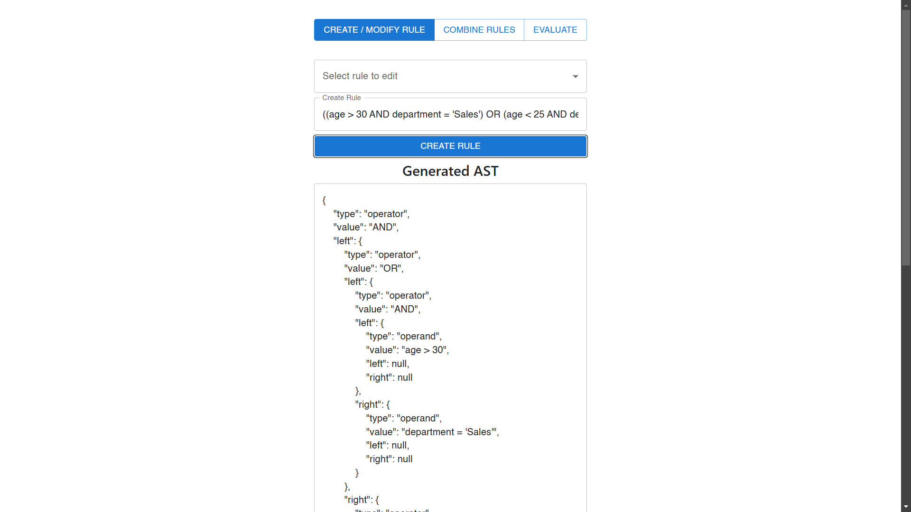
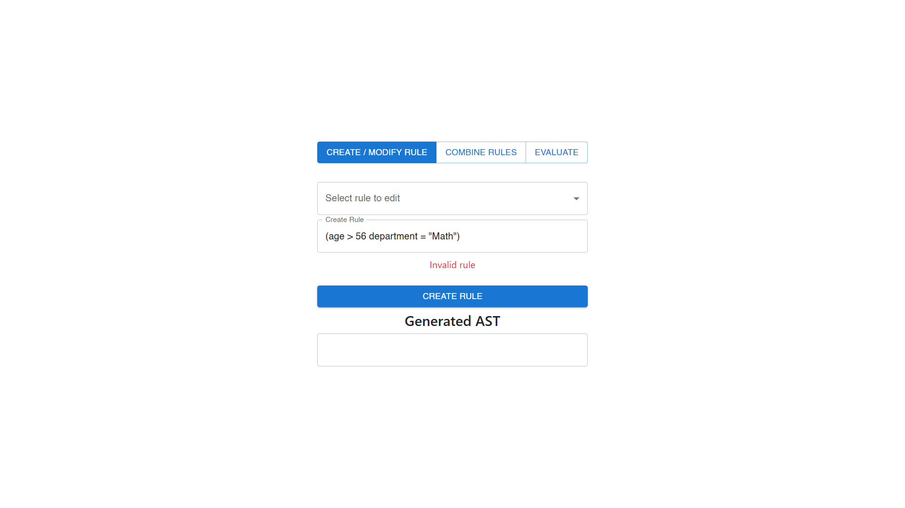
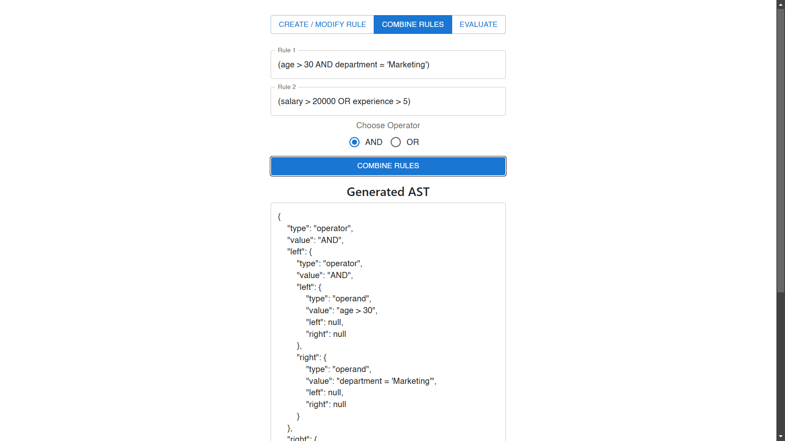
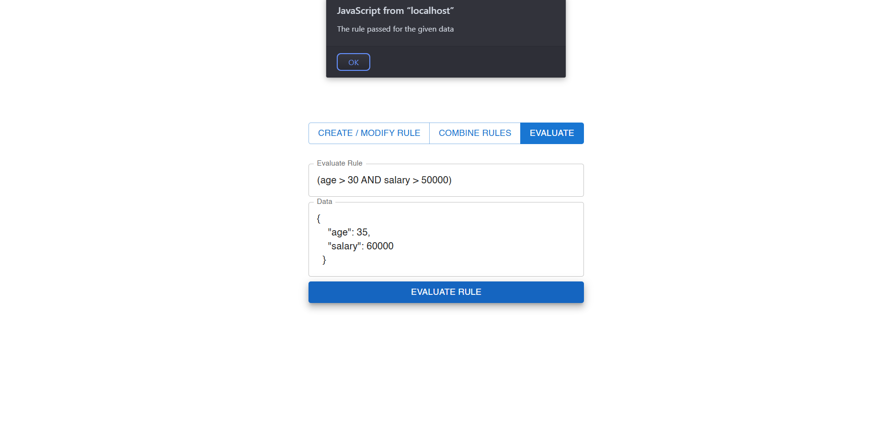

# Rule Engine With AST

## Overview

The Rule Engine with Abstract Syntax Tree (AST) is a simple 3-tier application designed to determine user eligibility based on various attributes such as age, department, income, and spend. The system utilizes AST to represent conditional rules and allows for dynamic creation, combination, and modification of these rules.

## Features

- **Rule Creation and Modification:** Define rules using a simple string format and edit existing rules.
- **Combine Multiple Rules:** Combine rules into a single rule.
- **Rule Evaluation:** Evaluate rules against JSON data.
- **API Endpoints:** Expose functionality through RESTful APIs.

## Technology Stack and Features

- ⚡ [**FastAPI**](https://fastapi.tiangolo.com) for the Python backend API.
  - 🧰 [SQLModel](https://sqlmodel.tiangolo.com) for the Python SQL database interactions (ORM).
  - 🔍 [Pydantic](https://docs.pydantic.dev), used by FastAPI, for the data validation and settings management.
  - 💾 [PostgreSQL](https://www.postgresql.org) as the SQL database.
- 🚀 [React](https://vite.dev) for the frontend.
  - 💻 Using TypeScript, hooks, Vite, and other parts of a modern frontend stack.
  - 🎨 [Material UI](https://mui.com/material-ui/) for the frontend components.

## Setup

1.**Clone the Repository**

   ```powershell
   git clone https://github.com/TinkerWizard/Rule-Engine-With-AST.git
   cd Rule-Engine-With-AST
   ```
2.**Install Dependencies**

```powershell
cd backend
pip install -r requirements.txt
```

```powershell
cd frontend
npm install
```

3.**Configure the Database**

Create and Update the `.env` file with your database credentials:

```
DB_USER=your_username
DB_PASSWORD=your_password
```

Ensure that the database and `rules` table exist. You may need to create the table manually if it does not exist:

```sql
CREATE TABLE rules (
    id INT AUTO_INCREMENT PRIMARY KEY,
    rule_string TEXT NOT NULL
);
```

4.**Run the Application**

```powershell
uvicorn main:app --reload
```

```powershell
npm run dev
```

## API Endpoints

#### Create / Modify Rule

- **URL:** `/save`
- **Method:** `POST`
- **Description:** This endpoint allows users to create a new rule by providing a rule string and generates the AST. Also, we can modify the exisiting rules. We fetch those rules from the database.



- **Request Body:**

  ```json
  {
    "rule_string": "((age > 30 AND department = 'Sales') OR (age < 25 AND department = 'Marketing')) AND (salary > 50000 OR experience > 5)"
  }
  ```

- **Response(AST):**
  ```json
  {
    "ast": {
      "type": "operator",
      "value": "AND",
      "left": {
        "type": "operator",
        "value": "OR",
        "left": {
          "type": "operator",
          "value": "AND",
          "left": {
            "type": "operand",
            "value": "age > 30",
            "left": null,
            "right": null
          },
          "right": {
            "type": "operand",
            "value": "department = 'Sales'",
            "left": null,
            "right": null
          }
        },
        "right": {
          "type": "operator",
          "value": "AND",
          "left": {
            "type": "operand",
            "value": "age < 25",
            "left": null,
            "right": null
          },
          "right": {
            "type": "operand",
            "value": "department = 'Marketing'",
            "left": null,
            "right": null
          }
        }
      },
      "right": {
        "type": "operator",
        "value": "OR",
        "left": {
          "type": "operand",
          "value": "salary > 50000",
          "left": null,
          "right": null
        },
        "right": {
          "type": "operand",
          "value": "experience > 5",
          "left": null,
          "right": null
        }
      }
    }
  }
  ```

#### Combine Rules

- **URL:** `/combine`
- **Method:** `POST`
- **Description:** This endpoint allows users to create a combine rules by providing a multiple rule string and generates the AST.


- **Request Body:**

  ```json
  {
    "rule_1": "(age > 30 AND department = 'Sales')",
    "rule_2": "(age < 25 AND department = 'Marketing')",
  }
  ```

- **Response(AST):**
  ```json
  {
    "ast": {
      "type": "operator",
      "value": "AND",
      "left": {
        "type": "operator",
        "value": "AND",
        "left": {
          "type": "operand",
          "value": "age > 30",
          "left": null,
          "right": null
        },
        "right": {
          "type": "operand",
          "value": "department = 'Sales'",
          "left": null,
          "right": null
        }
      },
      "right": {
        "type": "operator",
        "value": "AND",
        "left": {
          "type": "operand",
          "value": "age < 25",
          "left": null,
          "right": null
        },
        "right": {
          "type": "operand",
          "value": "department = 'Marketing'",
          "left": null,
          "right": null
        }
      }
    }
  }
  ```

### **Evaluate Rule**

- **URL:** `/evaluate`
- **Method:** `POST`
- - **Description:** This endpoint allows users to evaluate a rule by providing a multiple rule string and it returns either true or false.


- **Request Body:**

  ```json
  {
    "rule_string": "age > 30 AND salary > 50000",
    "data": {
      "age": 35,
      "salary": 60000
    }
  }
  ```

- **Response(boolean):**
  ```json
  {
    "result": true
  }
  ```

## Performance

- **Performance:** Consider optimizing rule evaluation logic for large datasets.
- **Error Handling** Invalid rules are not processed and not saved in the database.
